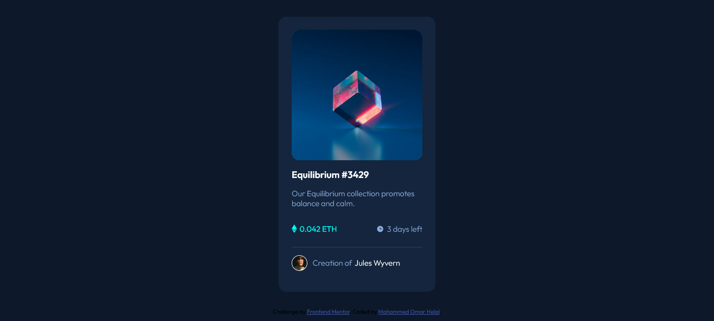

# Frontend Mentor - NFT preview card component solution

This is a solution to the [NFT preview card component challenge on Frontend Mentor](https://www.frontendmentor.io/challenges/nft-preview-card-component-SbdUL_w0U). Frontend Mentor challenges help you improve your coding skills by building realistic projects.

## Table of contents

- [Overview](#overview)
  - [The challenge](#the-challenge)
  - [Screenshot](#screenshot)
  - [Links](#links)
- [My process](#my-process)
  - [Built with](#built-with)
  - [What I learned](#what-i-learned)
  - [Continued development](#continued-development)
  - [Useful resources](#useful-resources)
- [Author](#author)
  **Note: Delete this note and update the table of contents based on what sections you keep.**

## Overview

### The challenge

Users should be able to:

- View the optimal layout depending on their device's screen size
- See hover states for interactive elements

### Screenshot

### Links

- Solution URL: [NFT Preview Card Repo](https://github.com/MohammedHelal/nft-preview)
- Live Site URL: [NFT Preview Card Site](https://mohammedhelal.github.io/nft-preview/)

## My process

### Built with

- Semantic HTML5 markup
- CSS custom properties
- Flexbox
- [React](https://reactjs.org/) - JS library
- [Vite JS](https://vitejs.dev/) - React build tool

### What I learned

It was interesting working with the positioning and z-indexes to make the view svg image appear on top of the image on hover,
Understanding how positioning works on each other and how that affects the z-index values was what i learnt the most.

### Continued development

I will continue to practice the positioning and z-indexing until I'm comfortable with them.

### Useful resources

- [StackOverflow answer](https://stackoverflow.com/questions/33925507/z-index-flickering-in-chrome-on-hover#:~:text=It's%20flickering%20because%20the%20element,relative%20to%20the%20parent%20element.) - This answer on stack overflow helped me understand what was happening with my code and why the view was flickering and not appearing properly.

## Author

- CodeSandBox - [MohammedHelal](https://codesandbox.io/u/MohammedHelal)
- Frontend Mentor - [@MohammedHelal](https://www.frontendmentor.io/profile/MohammedHelal)
